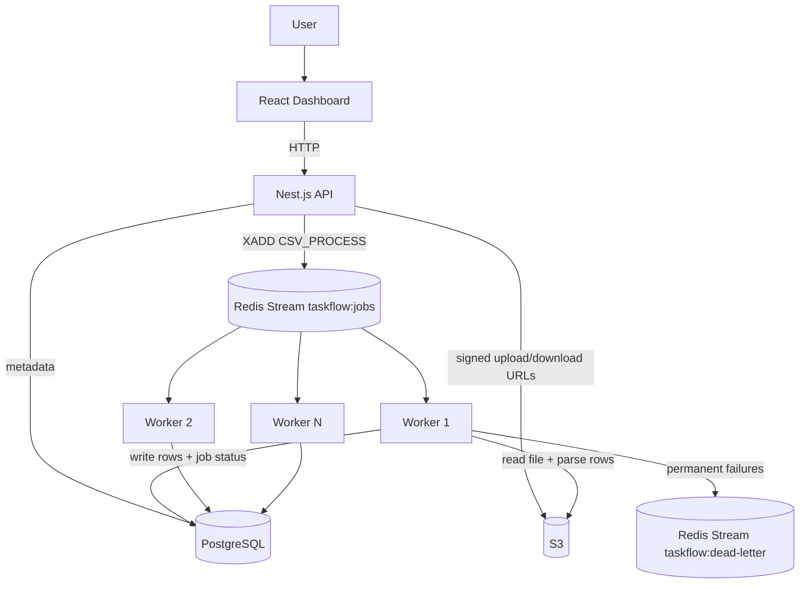

# TaskFlow

TaskFlow is a distributed CSV background-processing project built to demonstrate queue-based architecture, worker concurrency, retries, idempotency, crash recovery, and dead-letter handling.

## Architecture

### `How it works`
1. User selects and uploads a CSV file.
2. API stores metadata and returns a pre-signed S3 URL.
3. Frontend uploads the CSV directly to S3.
4. After upload, Frontend asks API to queue the file.
5. API adds a processing job to Redis Stream.
6. Worker continuously listening to **Redis Consumer Group**.
7. Worker consumes the job and reads CSV from S3.
8. Processed rows are stored in PostgreSQL.

#### `If Something Goes Wrong`
1. Worker fails while reading the CSV.
2. Worker records the error and increments job attempts.
3. Retry delay increases after each failed attempt.
4. After 3 attempts, the job becomes FAILED.
5. Failed jobs are copied to **Dead Letter Stream**.
6. Remain available for manual retry.

#### `Worker Crash Recovery`
1. Worker receives a job and starts processing it.
2. Worker crashes before confirming the job(XACK) is complete.
3. Redis keeps the job as pending instead of losing it.
4. After 30 seconds, another worker can reclaim the same job(XAUTOCLAIM).
5. The reclaimed job is processed again.

##### `Exponential Backoff`
- Retry delay increases after each failed attempt.

##### `Dead-Letter`
- Jobs that couldn't be successfully processed after all retry attempts
- These are copied to a dead-letter stream for manual inspection and retry.

##### `Concurrency`
- Each worker can handle up to 2 jobs concurrently.
- Multiple workers can process jobs simultaneously.

##### `Backpressure`
- Limit the number of concurrent jobs per worker (2 jobs per worker).
- Extra jobs remain in Redis until workers have capacity.

##### `Idempotency`
- Repeated processing of the same job doesn't create duplicate CSV rows.
- PostgreSQL enforces uniqueness using a composite key of `file_id + row_number`.

-------------------------------------------------------------------------------
#### Services

- `UI` — React + Vite + TypeScript dashboard
- `SERVER` — Nest.js API + PostgreSQL + Redis + AWS S3
- `WORKER` — Node.js + Redis Streams worker + Docker
