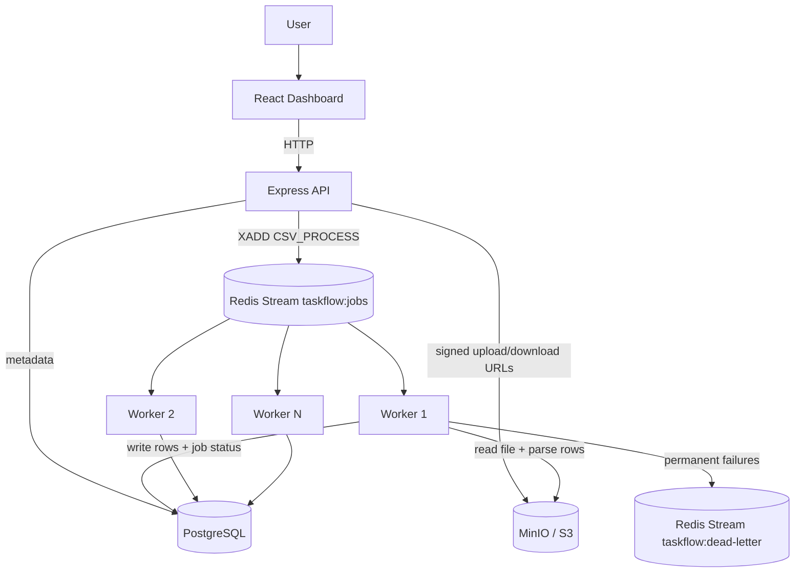

# TaskFlow

TaskFlow is a distributed CSV background-processing project built to demonstrate queue-based architecture, worker concurrency, retries, idempotency, crash recovery, and dead-letter handling.

## Services

- `ui` — React + Vite + TypeScript dashboard
- `server` — Express + TypeScript API
- `worker` — TypeScript Redis Streams worker

## Architecture



## Quick start

1. Install dependencies:

```bash
bun install
```

2. Copy the service environment templates and fill the shared infrastructure values:

```bash
cp server/.env.example .env
cp ui/.env.example ui/.env
```

3. Start infrastructure:

```bash
bun run db:up
```

4. Start applications (separate terminals recommended):

```bash
bun run dev:api
bun run dev:worker
bun run dev:web
```

Or run all three together:

```bash
bun run start
```

- API: `http://localhost:3000`
- Web: `http://localhost:5173`
- Worker: no HTTP port; it is a background process that consumes Redis jobs.

Set `VITE_API_URL=http://localhost:3000` in `ui/.env` so the dashboard calls the API directly.
Set `CORS_ORIGIN=http://localhost:5173` in the API environment (`.env` or `server/.env`) to allow the dashboard's browser requests. Use a comma-separated list when serving the UI from more than one origin.

Stop infrastructure:

```bash
bun run db:down
```

## Sample data

- `constants/customers.csv` — small demo file (~100 rows)
- `constants/customers-large.csv` — larger file (1,000 rows) for batching/backpressure tests

## API endpoints

- `GET /api/health` — service health with database/redis connectivity
- `GET /api/files`
- `POST /api/files`
- `GET /api/files/:fileId` — file details with latest job info
- `POST /api/files/:fileId/queue`
- `POST /api/jobs/:jobId/retry` — retry a failed job
- `GET /api/files/:fileId/rows?page=1&pageSize=100`
- `GET /api/files/:fileId/download`
- `GET /api/dead-letter?limit=50`

Errors use a consistent format:

```json
{
  "error": {
    "code": "FILE_NOT_FOUND",
    "message": "File not found."
  }
}
```

Health check example:

```json
{
  "status": "ok",
  "database": "connected",
  "redis": "connected"
}
```

## Processing flow

1. Web creates file metadata via `POST /api/files`.
2. API returns signed MinIO upload URL.
3. Web uploads CSV directly to MinIO.
4. Web queues the file via `POST /api/files/:fileId/queue`.
5. Worker consumes Redis Stream messages and processes CSV rows.
6. Worker writes parsed rows and status updates to PostgreSQL.
7. Web polls file details while status is `QUEUED`, `PROCESSING`, or `RETRY_WAITING`.

Worker concurrency is controlled in `worker/src/lib/config.ts` (`maxConcurrency`, default: `2`).

## Worker crash recovery

If a worker dies before acknowledging a Redis Stream message, the job stays in the consumer group's pending list.

On each poll the worker recovers work in this order:

1. **Own pending** — same `workerConfig.workerId`, not ACKed (immediate on restart)
2. **Stale pending** — idle longer than `pendingClaimIdleMs` (default: `30000`) via `XAUTOCLAIM`
3. **New messages** — fresh jobs from the stream tail

### Crash-recovery test

In `worker/src/lib/config.ts`:

```ts
export const workerConfig = {
  workerId: "worker-1",
  pendingClaimIdleMs: 5_000,
  // ...
} as const;
```

1. Upload a CSV and confirm processing starts.
2. Kill the worker mid-processing.
3. Restart the worker (same `workerConfig.workerId`).
4. Worker logs `Reclaimed own-pending message ...` and completes the job.

## Dead-letter queue

Jobs that exceed the retry limit are marked `FAILED` in PostgreSQL and copied to `taskflow:dead-letter`.

```bash
curl "http://localhost:3000/api/dead-letter?limit=20"
```

Failed jobs can still be retried from the dashboard via `POST /api/jobs/:jobId/retry`.

## Failure scenarios & demos

### Invalid upload

API rejects non-CSV names or invalid size with `INVALID_FILE` / `FILE_TOO_LARGE`.

### Simulated worker failures

Set in `worker/src/lib/config.ts`:

```ts
export const workerConfig = {
  failProcessing: true,
  // ...
} as const;
```

Restart the worker, upload a CSV, and observe:

```text
Attempt 1 → wait 1s → Attempt 2 → wait 2s → Attempt 3 → FAILED → dead-letter stream
```

Set `failProcessing: false` for normal operation.

### Missing storage object

Worker fails with `NoSuchKey`, retries with exponential backoff, then moves to dead-letter after max attempts.

### Worker crash before ACK

Unacknowledged messages stay pending and are reclaimed on restart.

## Worker config (`worker/src/lib/config.ts`)

| Setting | Default | Purpose |
|---------|---------|---------|
| `maxConcurrency` | `2` | Parallel jobs per worker process |
| `pendingClaimIdleMs` | `30000` | Stale pending reclaim threshold |
| `retryBaseDelayMs` | `1000` | Exponential backoff base delay |
| `failProcessing` | `false` | Dev-only forced failure mode |
| `workerId` | `worker-<pid>` | Stable id for own-pending reclaim |
| `deadLetterStreamKey` | `taskflow:dead-letter` | Dead-letter stream name |

The root `.env` holds shared infrastructure credentials (Postgres, Redis, MinIO) and API settings such as `PORT` and `CORS_ORIGIN`; use `server/.env.example` as its template. `ui/.env` holds the dashboard's `VITE_API_URL` setting. The worker has no browser-facing URL or CORS setting: it connects to Redis, PostgreSQL, and MinIO using its infrastructure configuration.

## Interview notes

- **Why Redis Streams?** Consumer groups, explicit ACKs, replay, and horizontal workers.
- **Why async upload + queue?** Keeps API fast; isolates slow CSV parsing in workers.
- **How is backpressure handled?** Queue depth absorbs spikes; `workerConfig.maxConcurrency` caps per-worker load.
- **How are retries controlled?** PostgreSQL tracks attempts; worker uses exponential backoff.
- **What about dead-letter?** Permanent failures go to `taskflow:dead-letter` for inspection.
- **What happens if a worker crashes?** Pending messages are reclaimed via own-pending or `XAUTOCLAIM`.
- **Idempotency?** Terminal job checks + `UNIQUE(file_id, row_number)` on parsed rows.

## Scope notes

- Authentication/authorization is intentionally out of scope.
- Version 1 (Phases 0–17) is complete for the core distributed-systems demo.
